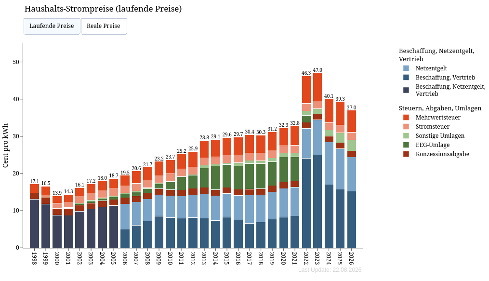
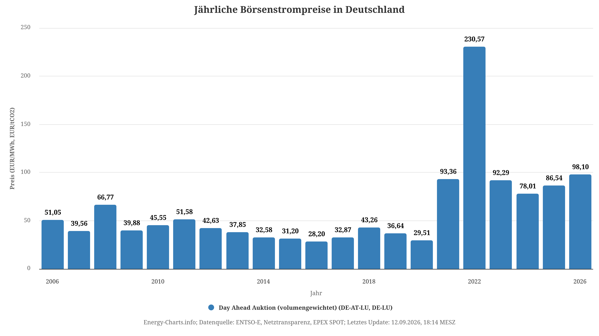
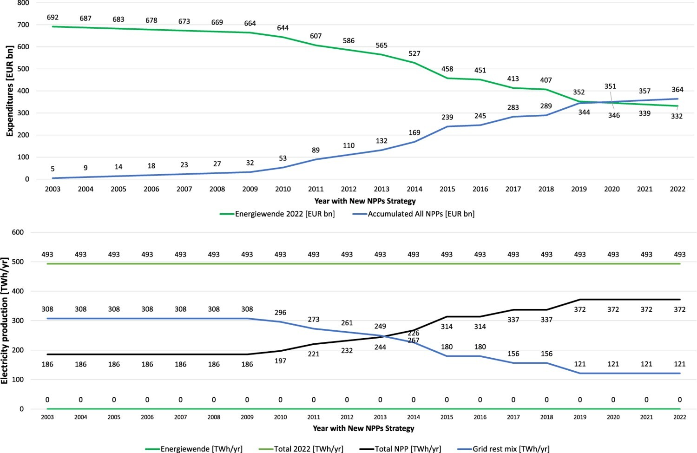

## Stromerzeugung: 2011 und 2023

```{python}
import pandas as pd
import matplotlib.pyplot as plt
f = "data/EBD25p1_Auswertungstabellen_deutsch1.xlsx"
auswertung = pd.read_excel(f, sheet_name="4.1", skiprows=3, index_col=1)
auswertung = auswertung.dropna(how="all")
auswertung = auswertung.dropna(axis=1, how="all")
einsatzpj = auswertung.copy().drop("Einheit", axis=1)
einsatzpj = einsatzpj.iloc[1:10]
einsatzpj = einsatzpj.apply(pd.to_numeric, errors="coerce")
einsatzpj_T = einsatzpj.T
einsatzpj_T.index.name = "Jahr"

einsatztwh = einsatzpj_T / 3.6

fig, ax = plt.subplots(figsize=(12, 7))

ax.stackplot(
    einsatztwh.index.to_numpy(dtype=float),
    einsatztwh.T.to_numpy(dtype=float),
    labels=einsatztwh.columns,
    alpha=0.9
)

ax.set_ylabel("TWh")
ax.legend(loc="upper left", bbox_to_anchor=(1, 1))
ax.axvline(2011, color="red", linestyle="--", linewidth=1.5)
ax.axvline(2023, color="red", linestyle="--", linewidth=1.5)
ax.grid(False)
for spine in ax.spines.values():
    spine.set_visible(False)
ax.tick_params(axis="both", length=0)
```

## Prozent @ag_energiebilanzen_e_v_auswertungstabellen_2026

```{python}
import pandas as pd
import matplotlib.pyplot as plt
f = "data/EBD25p1_Auswertungstabellen_deutsch1.xlsx"
auswertung = pd.read_excel(f, sheet_name="4.1", skiprows=3, index_col=1)
auswertung = auswertung.dropna(how="all")
auswertung = auswertung.dropna(axis=1, how="all")

einsatzpj = auswertung.copy().drop("Einheit", axis=1)
einsatzpj = einsatzpj.iloc[1:10]
einsatzpj = einsatzpj.apply(pd.to_numeric, errors="coerce")
einsatzpj_T = einsatzpj.T
einsatzpj_T.index.name = "Jahr"

einsatzprz = einsatzpj_T.div(einsatzpj_T.sum(axis=1), axis=0) * 100

jahre = einsatzprz.index.to_numpy(dtype=float)
anteile = einsatzprz.T

fig, ax = plt.subplots(figsize=(12, 7))

ax.stackplot(
    jahre,
    anteile.to_numpy(dtype=float),
    labels=anteile.index,
    alpha=0.9
)

ax.legend(loc="upper left", bbox_to_anchor=(1, 1))
ax.grid(False)
for spine in ax.spines.values():
    spine.set_visible(False)
ax.tick_params(axis="both", length=0)
```

## Strompreise @kost_levelized_2013, @kost_study_2024

```{python}
import numpy as np
import matplotlib.pyplot as plt

jahre = [2011, 2023]
kosten = {
    "Photovoltaik (PV)": {
        2011: (21.1, 40.0),
        2023: (4.1, 14.4),
    },
    "Windenergie (Onshore)": {
        2011: (6.0, 8.9),
        2023: (4.3, 9.2),
    },
    "Kernenergie": {
        2011: (5.5, 11.0),
        2023: (13.6, 49.0),
    },
}
farben = {
    "Photovoltaik (PV)": "#f2c94c",
    "Windenergie (Onshore)": "#4f8cc9",
    "Kernenergie": "#8c8c8c",
}

fig, ax = plt.subplots(figsize=(10, 6))
positionen = np.arange(len(jahre))
breite = 0.20

for offset, (traeger, werte) in zip(
    [-0.25, 0, 0.25], kosten.items()
):
    untergrenzen = [werte[jahr][0] for jahr in jahre]
    hoehen = [werte[jahr][1] - werte[jahr][0] for jahr in jahre]
    ax.bar(
        positionen + offset,
        hoehen,
        bottom=untergrenzen,
        width=breite,
        color=farben[traeger],
        label=traeger,
    )

ax.set_xticks(positionen, jahre)
ax.set_ylabel("ct/kWh")
ax.legend(loc="upper left")
ax.grid(False)
for spine in ax.spines.values():
    spine.set_visible(False)
ax.tick_params(axis="both", length=0)
```

## Haushalte @noauthor_open_nodate



## Großhandel Preise @energy-charts_durchschnittliche_2026



## Was wäre passieren, wenn...? @emblemsvag_what_2024



Falsch!

## CO2-Emissionen

<iframe src="https://ourworldindata.org/grapher/co-emissions-per-capita?time=1990..latest&country=~DEU&tab=line" loading="lazy" style="width: 100%; height: 600px; border: 0px none;" allow="web-share; clipboard-write"></iframe>


## Quellen  